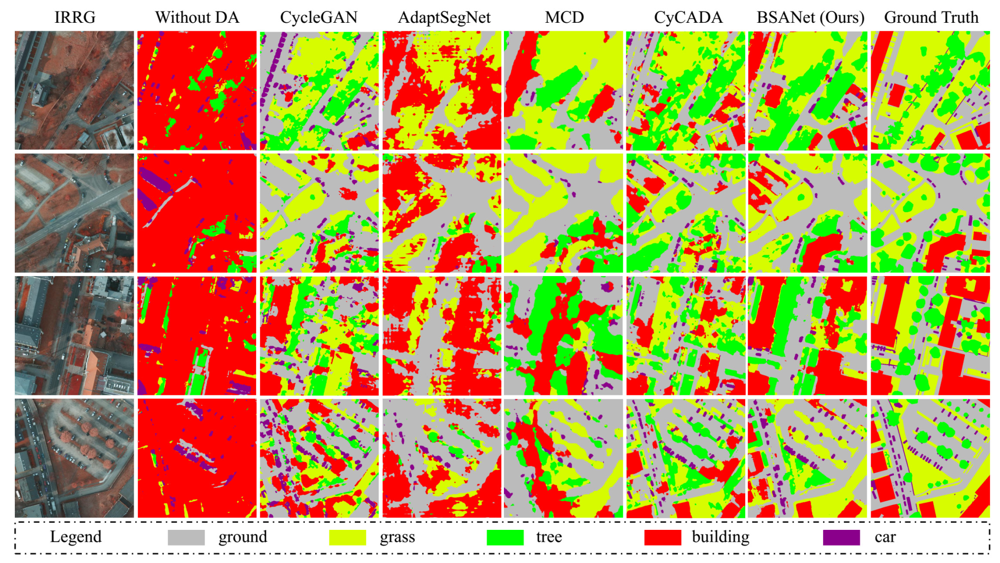

# Bispace Domain Adaptation Network for Remotely Sensed Semantic Segmentation

Pytorch implementation of Bispace Domain Adaptation Network for Remotely Sensed Semantic Segmentation.

Please note: Because the code is not organized in time, this should not be the code of the final version of the paper. But the basic structure inside is similar. For your reference only.

torch==0.4.0 torchvision===0.2.2

## Paper
[Bispace Domain Adaptation Network for Remotely Sensed Semantic Segmentation](https://www.researchgate.net/profile/Rongjun-Qin/publication/347005550_Bispace_Domain_Adaptation_Network_for_Remotely_Sensed_Semantic_Segmentation/links/5fe3b5c845851553a0e62dd6/Bispace-Domain-Adaptation-Network-for-Remotely-Sensed-Semantic-Segmentation.pdf) 

Please cite our paper if you find it useful for your research.

```
Liu, Wei, et al. "Bispace Domain Adaptation Network for Remotely Sensed Semantic Segmentation." IEEE Transactions on Geoscience and Remote Sensing (2020).
```

## Example semantic segmentation results 
Transferring from Vaihingen to Potsdam dataset



## Quantitative Reuslts


## Installation
* Clone this repo
```
git clone https://github.com/liujikun/BSANet.git
cd BSANet
```
## Dataset: ISPRS benchmark 2D Semantic Labeling Contest
* https://www2.isprs.org/commissions/comm2/wg4/benchmark/2d-sem-label-vaihingen/
* https://www2.isprs.org/commissions/comm2/wg4/benchmark/2d-sem-label-potsdam/

## Testing
* Download the pre-trained [BSANet model]() and put it at --restore-from

* Test the model 

```
python evaluate_Vin_BSANet.py --restore-from 
```


* Compute the IoU on ISPRS dataset
```
python compute_iou_ISPRS.py 
```

## Training Examples
* Train the BSANet model 

```
python train.py
```


## Acknowledgment
This code is heavily borrowed from [Pytorch-Deeplab](https://github.com/speedinghzl/Pytorch-Deeplab) and [AdaptSegNet](https://github.com/wasidennis/AdaptSegNet)


